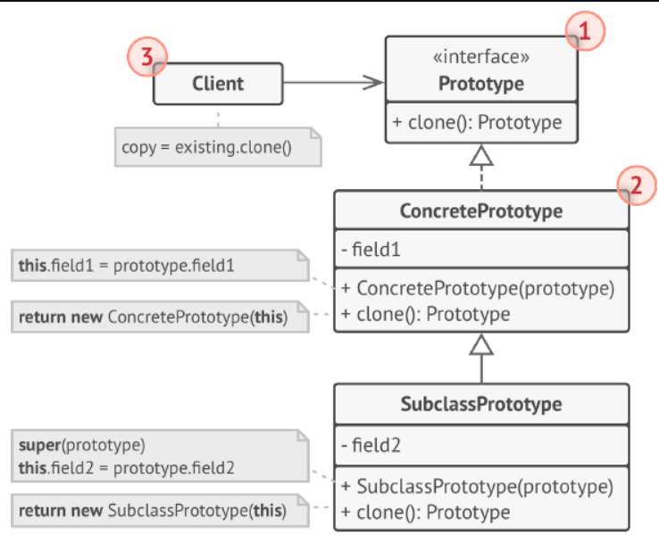
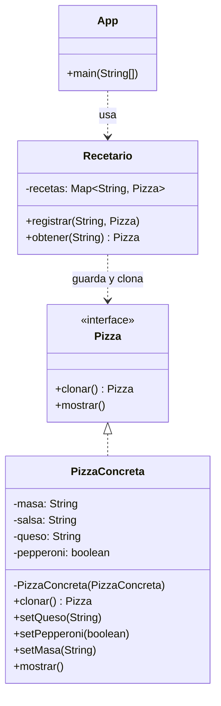

# Prototype (Prototipo)

## ¿Qué es Prototype?

Prototype es un patrón de diseño **creacional** que permite **copiar objetos existentes** sin que el código dependa de sus clases concretas. En lugar de crear un objeto desde cero, le pides al propio objeto que se clone a sí mismo.

Piénsalo como una fotocopiadora: en lugar de escribir un documento nuevo letra por letra, pones el original en la máquina y sacas una copia exacta.

---

## Estructura general



**Qué significa cada número de la imagen:**

1. **La interfaz Prototipo** declara el método de clonación (`clonar()`). Es el contrato que todos los prototipos deben cumplir.
2. **El Prototipo Concreto** implementa ese método: sabe cómo copiar sus propios valores al objeto resultante.
3. **El Cliente** puede producir una copia de cualquier objeto que cumpla la interfaz, sin conocer su clase concreta.
4. **El Registro de Prototipos** (opcional) centraliza el acceso a los prototipos más usados, guardándolos en una tabla `nombre → prototipo` para clonarlos cuando se necesiten.

---

## El problema

Imagina que eres el **Chef de una pizzería**. Tienes un recetario con pizzas base ya configuradas: la Margarita, la Pepperoni, la Hawaiana, etc. Cada una tiene sus ingredientes y su tipo de masa.

Ahora un cliente pide una pizza **casi igual** a la Margarita, pero con queso parmesano en lugar de mozzarella. Otro pide una Pepperoni sin pepperoni (una especie de "vegetariana").

El problema es que **reconstruir cada pizza desde cero** es repetitivo y propenso a errores. Si te equivocas en la masa o la salsa, la pizza sale mal.

La solución tradicional sería algo así:

```java
// Esto es lo que queremos EVITAR:
new Pizza("delgada", "tomate", "mozzarella", false);  // Margarita
new Pizza("delgada", "tomate", "parmesano", false);   // Casi Margarita pero con parmesano
new Pizza("gruesa", "tomate", "mozzarella", false);   // Pepperoni sin pepperoni
```

**Problemas concretos:**

- **Repetición:** escribes los mismos datos una y otra vez.
- **Errores:** es fácil olvidar un ingrediente o equivocarte en la masa.
- **Rigidez:** si cambias la receta base, tienes que actualizar cada pizza manualmente.
- **Acoplamiento:** el código que crea las pizzas necesita conocer todos los parámetros exactos.

---

## La solución

Se declara un método `clonar()` en la interfaz `Pizza`. Cada clase concreta lo implementa para devolver una copia de sí misma.

El flujo es el siguiente:

1. El Chef pide una pizza base al recetario: `recetario.obtener("PizzaMargarita")`.
2. El recetario busca la receta original y ejecuta `margarita.clonar()`.
3. El `clonar()` devuelve una copia idéntica, totalmente independiente.
4. El Chef modifica la copia a su gusto (por ejemplo, cambiar el queso).
5. La receta original del recetario **nunca se modifica**.

Además, se agrega un **Recetario (Registro de Prototipos)**: una "bóveda" donde el Chef guarda las pizzas base ya configuradas para clonarlas cuando las necesite.

---

## Estructura de la solución



---

## Código para probar

### La interfaz Prototipo

```java
// Pizza.java
public interface Pizza {
    Pizza clonar();
    void mostrar();
}
```

### El Prototipo Concreto

```java
// PizzaConcreta.java
public class PizzaConcreta implements Pizza {
    private String masa;
    private String salsa;
    private String queso;
    private boolean pepperoni;

    public PizzaConcreta(String masa, String salsa, String queso, boolean pepperoni) {
        this.masa = masa;
        this.salsa = salsa;
        this.queso = queso;
        this.pepperoni = pepperoni;
    }

    // Constructor de copia: usado internamente por clonar().
    private PizzaConcreta(PizzaConcreta original) {
        this.masa = original.masa;
        this.salsa = original.salsa;
        this.queso = original.queso;
        this.pepperoni = original.pepperoni;
    }

    @Override
    public Pizza clonar() {
        return new PizzaConcreta(this);
    }

    public void setQueso(String queso) { this.queso = queso; }
    public void setPepperoni(boolean pepperoni) { this.pepperoni = pepperoni; }
    public void setMasa(String masa) { this.masa = masa; }

    @Override
    public void mostrar() {
        System.out.println("Pizza [masa=" + masa + ", salsa=" + salsa
                + ", queso=" + queso + ", pepperoni=" + pepperoni + "]");
    }
}
```

### El Registro de Prototipos

```java
// Recetario.java
import java.util.HashMap;
import java.util.Map;

public class Recetario {
    private Map<String, Pizza> recetas = new HashMap<>();

    public void registrar(String nombre, Pizza pizza) {
        recetas.put(nombre, pizza);
    }

    public Pizza obtener(String nombre) {
        Pizza receta = recetas.get(nombre);
        if (receta != null) {
            // Aqui se usa clonar(): devolvemos una copia, no el original.
            return receta.clonar();
        }
        return null;
    }
}
```

### El cliente

```java
// App.java
public class App {
    public static void main(String[] args) {
        // 1. El Chef configura el recetario con pizzas base
        Recetario recetario = new Recetario();

        PizzaConcreta margarita = new PizzaConcreta("delgada", "tomate", "mozzarella", false);
        PizzaConcreta pepperoni = new PizzaConcreta("gruesa", "tomate", "mozzarella", true);

        recetario.registrar("PizzaMargarita", margarita);
        recetario.registrar("PizzaPepperoni", pepperoni);

        // 2. El Chef clona (el clonar() ocurre dentro de obtener())
        PizzaConcreta clon1 = (PizzaConcreta) recetario.obtener("PizzaMargarita");
        clon1.setQueso("parmesano");

        PizzaConcreta clon2 = (PizzaConcreta) recetario.obtener("PizzaPepperoni");
        clon2.setPepperoni(false);

        // 3. Mostrar resultados
        System.out.println("--- Recetas originales (sin cambios) ---");
        margarita.mostrar();
        pepperoni.mostrar();

        System.out.println("\n--- Clones modificados ---");
        clon1.mostrar();
        clon2.mostrar();
    }
}
```

Salida esperada:

```
--- Recetas originales (sin cambios) ---
Pizza [masa=delgada, salsa=tomate, queso=mozzarella, pepperoni=false]
Pizza [masa=gruesa, salsa=tomate, queso=mozzarella, pepperoni=true]

--- Clones modificados ---
Pizza [masa=delgada, salsa=tomate, queso=parmesano, pepperoni=false]
Pizza [masa=gruesa, salsa=tomate, queso=mozzarella, pepperoni=false]
```

Fíjate que las recetas originales siguen intactas. Modificar el clon no afecta al recetario.

---

## ¿En qué momento se usa `clonar()`?

Este es el punto más importante del patrón, así que vale la pena detallarlo.

El `clonar()` **no lo llama el Chef directamente**. Lo llama el Recetario, dentro del método `obtener()`:

```java
public Pizza obtener(String nombre) {
    Pizza receta = recetas.get(nombre);
    if (receta != null) {
        return receta.clonar();   // <-- AQUI se ejecuta clonar()
    }
    return null;
}
```

El flujo completo, paso a paso, es:

| Paso | Qué pasa | Quién lo ejecuta |
|---|---|---|
| 1 | El Chef pide `recetario.obtener("PizzaMargarita")` | Cliente (App) |
| 2 | El Recetario busca la receta original en su mapa | Recetario |
| 3 | El Recetario llama a `margarita.clonar()` | Recetario |
| 4 | La pizza original construye una copia de sí misma | PizzaConcreta |
| 5 | El Recetario devuelve la copia al Chef | Recetario |
| 6 | El Chef modifica la copia con `setQueso(...)` | Cliente (App) |
| 7 | La receta original permanece intacta | — |

Gracias a este diseño, el Chef nunca toca las recetas originales: siempre trabaja sobre copias. Y si mañana quiere agregar una pizza nueva (por ejemplo, "PizzaHawaiana"), solo la registra una vez y ya puede clonarla cuantas veces quiera.

---

## Copia Superficial vs. Copia Profunda

Cuando clonas un objeto que tiene listas u otros objetos dentro, debes tener cuidado:

- **Copia Superficial (Shallow Copy):** copia los valores, pero si hay una lista, ambas copias comparten la misma lista. Si modificas la lista en una copia, también se modifica en la otra. ⚠️
- **Copia Profunda (Deep Copy):** copia todo, incluso las listas internas. Cada objeto es totalmente independiente. ✅

En el ejemplo de la pizzería usamos copia profunda porque solo tenemos atributos simples. Si `PizzaConcreta` tuviera una lista de ingredientes extras, habría que copiarla también:

```java
// Ejemplo de copia profunda de una lista:
this.ingredientesExtras = new ArrayList<>(original.ingredientesExtras);
```

Si hicieras copia superficial (`this.ingredientesExtras = original.ingredientesExtras`), dos pizzas distintas compartirían la misma lista de ingredientes, y agregar un ingrediente a una afectaría a la otra sin querer.

---

## Cuándo usarlo y cuándo no

**Úsalo cuando:**

- Tu código no deba depender de las clases concretas de los objetos que necesitas copiar.
- Crear un objeto desde cero sea costoso (en tiempo o recursos).
- Quieras evitar código de inicialización repetitivo.
- Necesites producir objetos complejos de forma más fácil.
- Tengas plantillas o configuraciones base que se reutilizan mucho.

**Evítalo cuando:**

- El objeto es simple y no tiene referencias internas.
- No necesitas copias, sino objetos nuevos desde cero.
- El objeto tiene referencias circulares complejas: la copia profunda se vuelve muy complicada.

---

## Resumen

| Aspecto | Prototype |
|---|---|
| **Tipo** | Creacional |
| **Qué problema resuelve** | Copiar objetos sin depender de sus clases concretas |
| **Cómo se hace en Java** | Interfaz con método `clonar()`, constructores de copia, y opcionalmente un registro de prototipos |
| **Lo mejor** | Evitas acoplarte a clases concretas y código de copia repetitivo |
| **Lo malo** | La copia profunda puede ser complicada con objetos anidados |
| **Se parece a** | **Builder** construye paso a paso; **Prototype** copia un objeto ya existente |